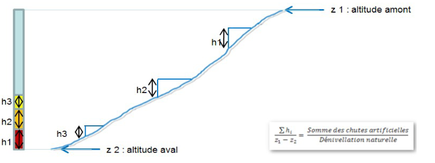

```{r setup, include=FALSE}

knitr::opts_chunk$set(
  echo = FALSE,
  message = FALSE,
  warning = FALSE
  )

library(tidyverse)
library(sf)
library(ggtext)

load("../data_prepared/ROE_data.RData")

'%>%' <- dplyr::'%>%'

```

```{=openxml} 
<w:p><w:r><w:br w:type="page"/></w:r></w:p>
```

<br>

# [Caractéristiques du cours d'eau]{.underline}

<br>

```{r Info_TR2}


Info_TR2 <- Info_L2 %>%  dplyr::filter(label_troncon_L2 == params$CE) %>% dplyr::select((!nb_ouv:H_cum))

L_Info_TR2 <- Info_TR2  %>% dplyr::select((code_ME_valid:pt_nat)) %>% dplyr::mutate(dplyr::across(3:6, round, 0),
                                                                           pt_nat = round(pt_nat,1)) %>% knitr::kable(
    col.names = c(
      "Code de la masse d'eau",
      "Nom du tronçon liste 2",
      "Longueur du cours d'eau (en km)",
      "Altitude du point le plus en aval (en m)",
      "Altitude du point le plus en amont (en m)",
      "Dénivelé naturel (en m)",
      "Pente moyenne (en ‰)"))

L_Info_TR2

```
<br>

# [Nombre d'ouvrages]{.underline}

<br>

```{r Info ouvrages}

tab_L2 <- 
  ROE_Normandie_H_L2 %>% dplyr::filter(label_troncon_L2 == params$CE) %>%  sf::st_drop_geometry()


ouv_p <- 
  tab_L2 %>% dplyr::filter(ouv_liaison == "ouvrage principal")

tab_ouv <- 
  ouv_p %>% 
  dplyr::mutate(nb_ouv = nrow(tab_L2),
                nb_ouvp = nrow(ouv_p),
                d_ouvp = round(nrow(ouv_p)/Info_TR2$longueur,1)) %>% 
  dplyr::select(label_troncon_L2, nb_ouv, nb_ouvp, d_ouvp) %>% 
  unique() %>% 
    knitr::kable(
    col.names = c(
    "Nom du cours d'eau",
    "Nombre d'ouvrages total",
    "Nombre d'ouvrages sur le cours principal",
    "Densité d'ouvrages sur le cours principal par km"
    ))
tab_ouv

```

<br>

# [Hauteurs artificielles par état des ouvrages]{.underline}

<br>

```{r etat ouvarges principaux}

tab_count <- ouv_p %>%  dplyr::count(etat)

tab_h_arti <- ouv_p %>%
  dplyr::group_by(etat) %>%
  dplyr::mutate(Hauteur_cumul = round(sum(hauteur, na.rm = TRUE), 0)) %>% 
  dplyr::ungroup(etat) %>%
  dplyr::select(etat, Hauteur_cumul) %>%
  unique() %>%
  dplyr::mutate(prop = round(Hauteur_cumul / sum(Hauteur_cumul) * 100, 0))

tab_h_arti <- dplyr::left_join(tab_h_arti, tab_count)

tab_h_arti <- tab_h_arti %>%
  dplyr::relocate(n, .before = 'Hauteur_cumul') %>%
  dplyr::arrange(etat) %>%
  dplyr::bind_rows(dplyr::summarise(.,
                      across(where(is.numeric), sum),
                      across(where(is.character), ~"Total"))) %>% 
  dplyr::rename(
    "État" = "etat",
    "Nombre d'ouvrages sur le cours principal" = "n",
    "Hauteurs cumulées (en m)" = "Hauteur_cumul",
    "Rapport des hauteurs cumulées sur la pente naturelle (en %)" = "prop"
  ) %>%
  knitr::kable()


tab_h_arti
      
```

```{=openxml} 
<w:p><w:r><w:br w:type="page"/></w:r></w:p>
```

<br>

# [Carte du cours d'eau : **``r stringr::str_to_title(params$CE)``**]{.underline}

<br>

<center> 
```{r Carte_CE}


tab_L2 <-
  ROE_Normandie_H_L2 %>% dplyr::filter(label_troncon_L2 == params$CE) %>%
  sf::st_as_sf(crs = 4326)

CE_L2_lin  <- CE_L2_lin %>% 
  sf::st_as_sf(crs = 4326) %>% dplyr::filter(label_troncon_L2 == params$CE) 
    
  pal <- leaflet::colorFactor(palette = c("#000099", "#FFFF00", "#990000"),
                                levels = c("Détruit entièrement", "Détruit partiellement", "Existant"),
                              na.color = 'grey')

map <- leaflet::leaflet(tab_L2) %>%
  leaflet::addTiles() %>%
  leaflet::addPolylines(data = CE_L2_lin , color = "#56B4E9",
                            opacity = 0.8 ) %>%
  leaflet::addCircleMarkers(
    popup = paste(
      "Code ROE : ",tab_L2$ROE,"<br/>",
      "Nom de l'ouvrage : ",tab_L2$Nom_ouvrage,"<br/>",
      "Type d'ouvrage et sous-type : ",tab_L2$type,"; ",tab_L2$sous_type,"<br/>",
      "État de l'ouvrage : ",tab_L2$etat,"<br/>",
      "Hauteur de chute de l'ouvrage : ",tab_L2$hauteur," m"
    ),
    radius = 6,
    fillColor = ~pal(etat),
    fillOpacity = 1,
    stroke = TRUE,
    color = "black",
    weight = 2,
    opacity = 1

  ) %>% 
      leaflet::addLegend("bottomleft", pal = pal, values = ~tab_L2$etat,
                         title = "État des ouvrages",
                         opacity = 1
      ) %>%
      
      # Ajout d'une minimap
      leaflet::addMiniMap(
        position = "topright",
        tiles = leaflet::providers$Esri.WorldStreetMap,
        toggleDisplay = TRUE,
        minimized = FALSE
      ) %>% 
      
      # Ajout de l'échelle
      leaflet::addScaleBar(
        position = "bottomright",
        options = leaflet::scaleBarOptions(imperial = FALSE)
      )


htmlwidgets::saveWidget(widget = map,
                        file = "temp.html",
                        selfcontained = FALSE)

webshot2::webshot(url = "temp.html",
                 file = "map.png",
                 cliprect = "viewport",
                  vwidth = 700,
                  vheight = 700)

```
</center>

```{=openxml} 
<w:p><w:r><w:br w:type="page"/></w:r></w:p>
```

<br>

# [Répartition des hauteurs de chute sur le cours principl du cours d'eau]{.underline}

<br>

```{r Barplot_classe_hauteur_et_etat, fig.width = 11, fig.height = 6}

ch <- ouv_p %>% dplyr::filter(!is.na(hauteur)) %>% 
  ggplot2::ggplot(ggplot2::aes(x = classe_hauteur, fill = etat)) +
  ggplot2::scale_fill_manual(values = c("Existant" = "#990000", "Détruit partiellement" = "#FFFF00",
                                            "Détruit entièrement" ="#000099")) +
  ggplot2::scale_x_discrete(guide = ggplot2::guide_axis(n.dodge=2)) +
  ggplot2::geom_bar(ggplot2::aes(x = factor(
    classe_hauteur,
    level = c(
      "Inférieur à 0.5m",
      'De 0.5m à inférieur à 1m',
      'De 1m à inférieur à 1.5m',
      'De 1.5m à inférieur à 2m',
      'De 2m à inférieur à 3m',
      'De 3m à inférieur à 5m',
      'De 5m à inférieur à 10m',
      'Supérieur à 10m'
    )
  ))) +
  ggplot2::xlab("Intervalles de hauteur de chute (m)") + ggplot2::ylab("Nombre d'ouvrages") +
  ggplot2::ggtitle(label = "Répartition des hauteurs de chute en fonction de leurs classes et de l'état des ouvrages sur le cours principal") +
  ggplot2::labs(fill = "État :", subtitle = sprintf(stringr::str_to_title(params$CE))) +
  ggplot2::theme(plot.caption =  ggplot2::element_text(hjust = 0, margin = ggplot2::margin(0, 0, 0, 0, "pt")),
        plot.margin = ggplot2::margin(0, 5.5, 5.5, 5.5, "pt")) +
  ggplot2::labs(caption = paste(sprintf(format(Sys.time(), '%d/%m/%Y')),
                                "Sources : OFB, Geobs, DR Normandie",
                                "Notes : Les ouvrages ne comportant pas de hauteurs de chutes on été retirés", sep = "\n"))

# viridis::scale_fill_viridis(discrete = TRUE)


ch
  
```

<br>

Ce graphique présente le nombre d'ouvrages par intervalles de hauteur de chute sur le cours principal du cours d'eau et en fonction de leur état.  

```{=openxml} 
<w:p><w:r><w:br w:type="page"/></w:r></w:p>
```


# [Taux d'étagement]{.underline}

Le taux d'étagement est un indicateur qui reflète la perte de pente naturelle engendrée par le cumul des hauteurs d'ouvrages transversaux. Cette métrique permet de quantifier la pression qu'exerce des ouvrages sur le fonctionnement des cours d'eau et de l'habitat qu'il représente. Ce taux d'étagement est calculé comme suit :

<br>

<center>
```{r Image_TE}

```
</center>

<br>

LE SDAGE 2022-2027 du Bassin de la Seine et des cours d’eau côtiers normands a fixé des objectifs environnementaux dans l'intérêt des milieux au regard du respect des usages et des activités existantes. L'atteinte de ces objectifs ne peut se faire qu'en associant tous les acteurs concernés par la contunuité écologique. Cela implique de cibler, sur la base d’études ou d’observations locales, une valeur du taux d’étagement en deçà de 30 % pour les masses d’eau à enjeux pour les poissons migrateurs (PLAGEPOMI) et pour les masses d’eau naturelles en risque de non-atteinte des objectifs environnementaux pour l’hydromorphologie. La valeur cible du taux d’étagement a pour finalité de permettre aux espèces d’accéder aux différents milieux nécessaires à la réalisation de leur cycle de vie.  

<br>

### Le tronçon liste 2 : "**``r stringr::str_to_title(CE_L2_lin$NomZone_L2_sandre)``**" ayant pour code(s) masse d'eau : **``r Info_TR2$code_ME_valid``** a un taux d'étagement de : [**``r Info_TR2$TE``**]{.underline} %.

