```{r setup, include=FALSE}
knitr::opts_chunk$set(echo = TRUE)
```

# 0. Introduction

## a) Prérequis : 

- Il faut que vous ayez un compte geobs et vos identifiants sous la main.

* Si c'est la première fois que vous lancer l'outil : il faut que ouvriez le dossier scripts :

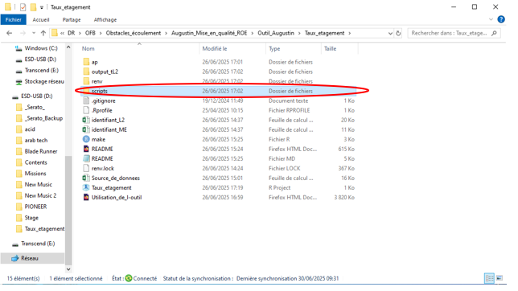

- Puis lancer le script : "01_import_donnees.R" 

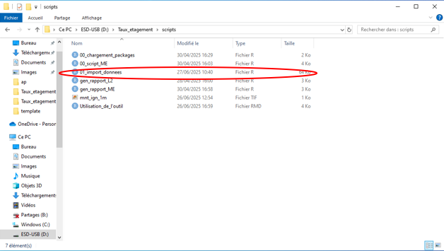

- Ensuite vous devez renseigner vos identifiants aux lignes 42 et 43 entre les guillemets.

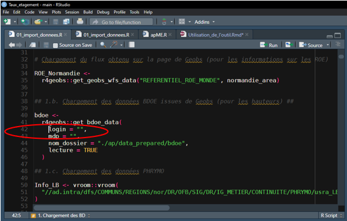

- Vous pouvez ensuite fermer ce script.

-> Lancer le fichier : "Taux_etagement.RProject"

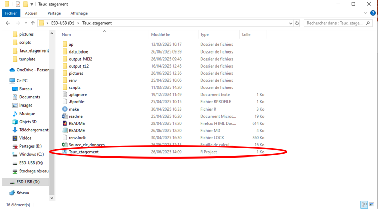

-> Lancer le fichier : "make.R"

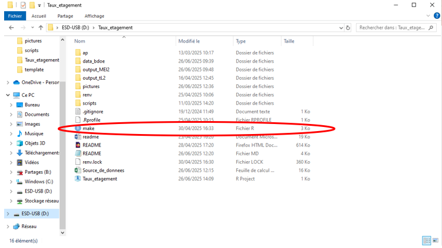

* Pour lancer chacune des lignes du script, il faut mettre son curseur au début de la ligne et maintenir les touches ctrl + entrer enfoncées. Il n'y a pas besoin d'utiliser toutes les lignes du script.


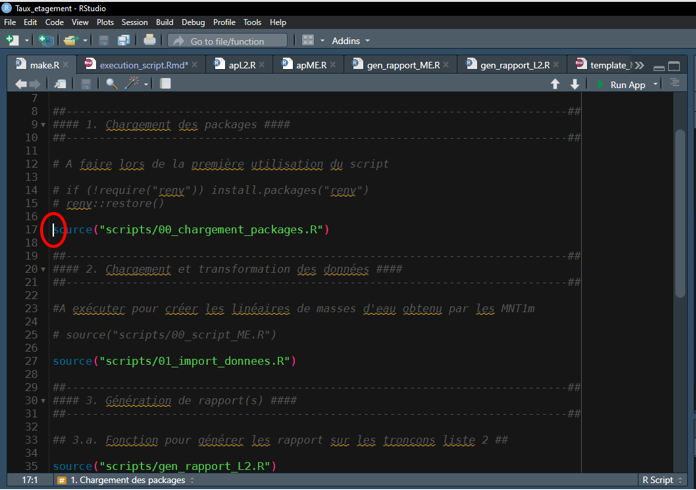


*Chacun des titres suivants correspond aux différentes étapes du script : "make.R"


# 1. Chargement des packages 

Si c'est la première fois que vous utilisez cet outil, il est nécessaire de décommenter les lignes de codes 14 et 15 afin de télécharger les packages requis. Pour se faire, il vous suffit de retirer le : "#" au début de ces 2 lignes.

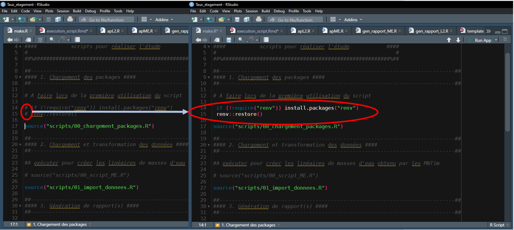

Il vous suffit ensuite d'exécuter les lignes 14, 15 et 17 afin de charger les packages requis pour faire fontionner cet outil. 

# 2. Import et transformation des données

Ce script va ensuite vous télécharger les données nécessaires à l'outil pour fonctionner et les formater.

Il vous suffit d'exécuter la ligne 27 comme vu précédemment. 

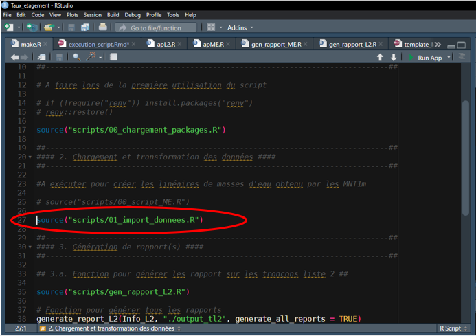

# 3. Génération de rapport(s)

Ce script permet de générer des rapports :

[a) Sur les tronçons liste 2]{.underline}

Veuillez dans un premier temps exécuter la ligne de code 35.

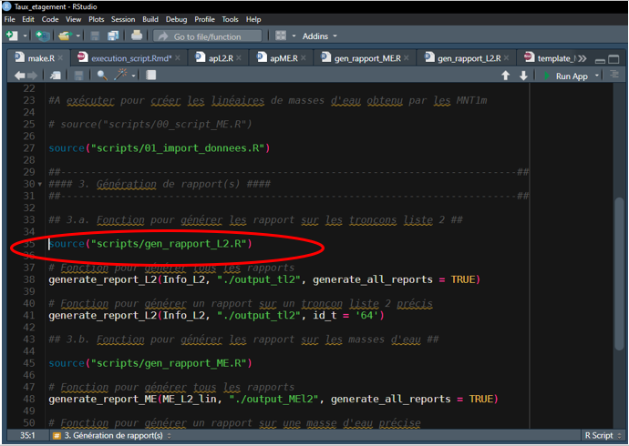

Puis vous avez la possibilité :

- Soit de générer des rapports pour l'ensemble des tronçons liste 2 en lançant la ligne de code 38

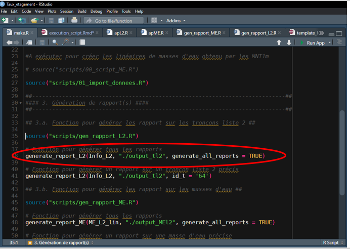

- Soit de générer un rapports sur un tronçon liste 2 particulier en lançant la ligne de code 41 et en précisant son numéro d'identifiant juste ici :

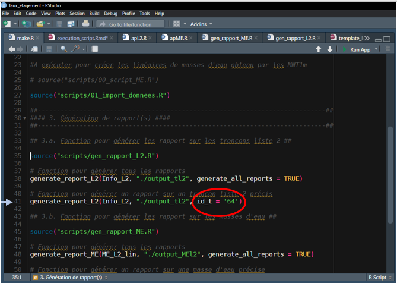
*Le numéro d'identifiant du tronçon liste 2 est à retrouver ici : "identifiant_L2.xlsx"

-> Les fiches rapports sont générées dans le dossier suivant : "output_tl2"
*Des exemples de fiches sont disponibles dans ce-dernier.

[b) Sur les masses d'eau du PLAGEPOMI]{.underline}

Veuillez dans un premier temps exécuter la ligne de code 45.

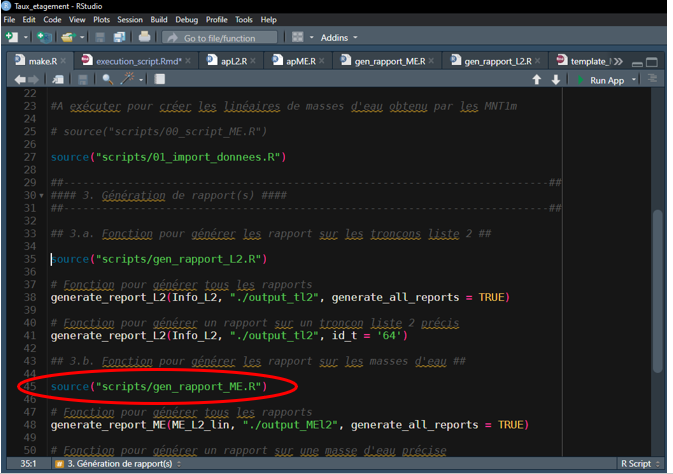

Puis vous avez la possibilité :

- Soit de générer des rapports pour l'ensemble des masses d'eau en lançant la ligne de code 4

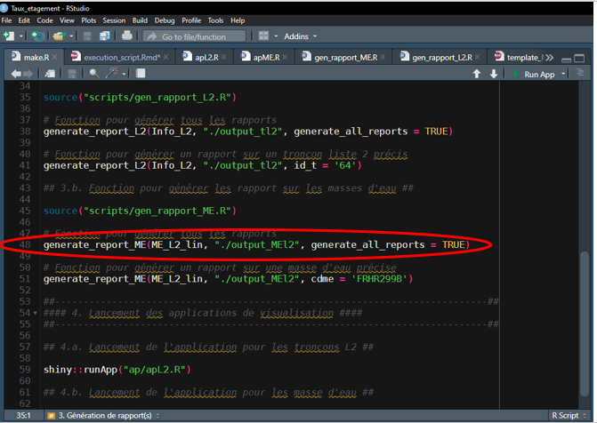

- Soit de générer un rapports sur masse d'eau particulière en lançant la ligne de code 51 et en précisant son code masse d'eau :

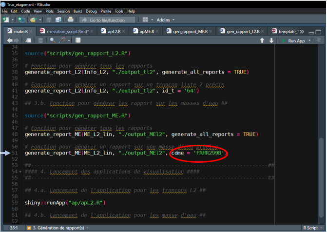
*Le numéro de la masse d'eau est à retrouver ici : "identifiant_ME.xlsx"

-> Les fiches rapports sont générées dans le dossier suivant : "output_MEl2"
*Des exemples de fiches sont disponibles dans ce-dernier.

# 4. Lancement des applications de visualisation

Cet outil de visualisation ce présente sous la forme de 2 applications R.shiny : l’une pour visualiser les tronçons de cours d’eau classés liste 2 ; l’autre pour visualiser les 74 masses d’eau du PLAGEPOMI. 

Sur le 1er onglet ; il est possible d’avoir un résumé rapide de différentes métriques utiles au calcul du taux d’étagement ainsi que la mesure de cet indicateur sur l’ensemble des tronçons ou masses d’eau à l’échelle de la région. Il vous est également possible de télécharger un fichier .csv ou .xlsx de l'image du tableau présent sur la page en cliquant ici : 

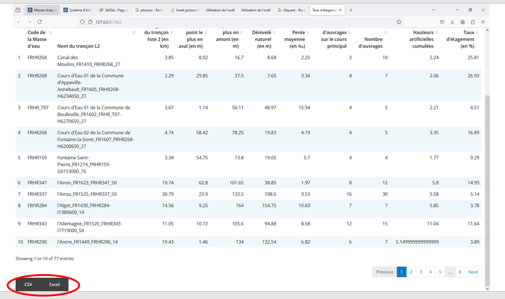

*Il vous suffit d'ajuster le nombre de lignes pour en télécharger le nombre souhaité.

Sur le 2nd onglet, il est possible de spécifier un tronçon ou une masse d’eau afin de se renseigner plus en détail sur les métriques et son taux d’étagement. Il vous est également possible de télécharger la fiche rapport correpondant au tronçon liste 2 ou à la masse d'eau que vous êtes en train de visualiser ne cliquant ici :  

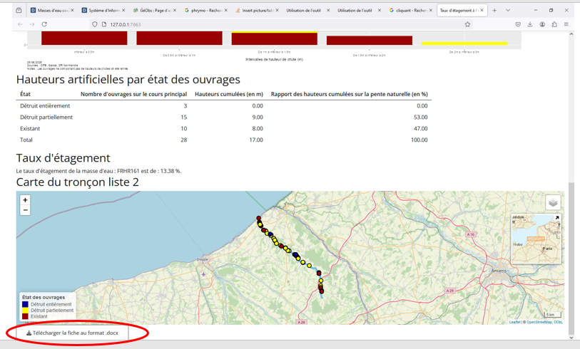
